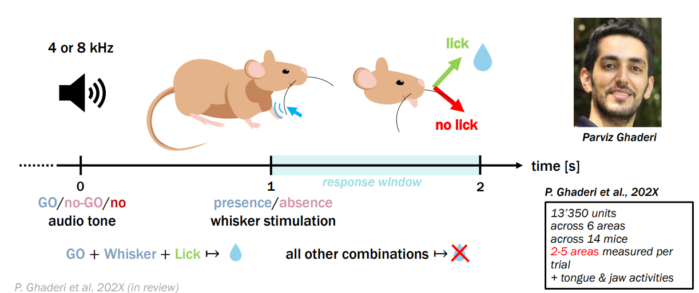
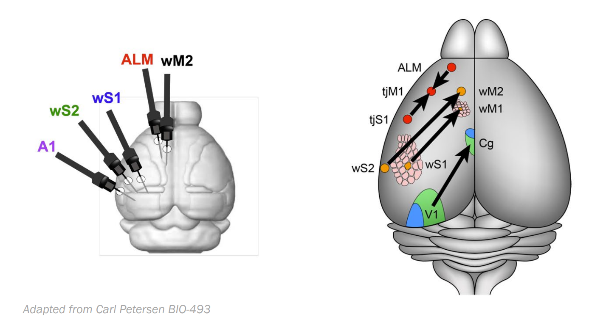
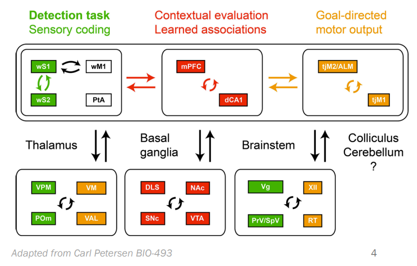
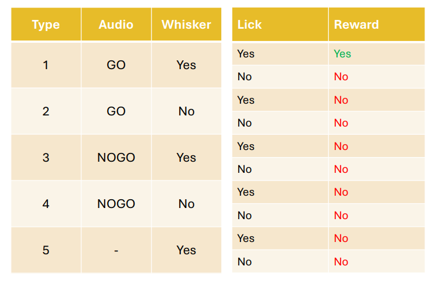

# Neural Trial-Type Decoding (BIO-322)

## Overview
Parviz Ghaderi (Carl Petersen lab, EPFL) recorded mouse neural activity and behavior across multiple sessions and trials. Each 3-second trial contains combinations of auditory tones and whisker deflections plus a possible lick response; rewards are delivered when the lick matches the required contingency. The goal is to predict the trial type (stimuli + lick response) from neural activity.

## Experiment Snapshot
- 5 brain areas: A1, ALM, wS1, wS2, wM2
- Layers vary by region (e.g., L1, L2/3, L4, L5, L6a, L6b)
- Two neuron types: EXC (excitatory) and INH (inhibitory)
- 30 time bins (100 ms each) per region-layer-celltype combination
- Sessions → trials (3 s) → stimuli (tone/whisker) → lick response → reward

## Data
- train.csv — trials with labels (`TRIAL_TYPE`)
- test.csv — trials without labels (predict here)
- sample_submission.csv — template for competition submissions

Columns include `session_id`, `trial_number`, neural features named like `ALM_L1_EXC_time_13` (mean spikes for that population and 100 ms bin), and `TRIAL_TYPE` (e.g., `NOGO W+ nolick`).

## Repository Guide
- notebooks/01_inspection.ipynb — data loading, structure inspection, visualizations
- notebooks/02_preprocessing.ipynb — cleaning, feature engineering, scaling, PCA, export
- notebooks/03_linear_model.ipynb — baseline linear modeling scaffold
- documents/project_info.ipynb — background and project description
- data/processed/ — generated by preprocessing (scaled matrices, transforms, feature names)

## 1. Data Visualization
Visualization of the data structure, neural regions represented, distribution of trial types, activity and feature correlation heatmaps and time series data.

## 2. Preprocessing (02_preprocessing.ipynb)
1. Load train/test; separate features and labels
2. Drop features with >80% missing values
3. Distance-weighted kNN imputation after temporary standardization
4. Add region-layer-celltype aggregates and session one-hot encodings
5. Prune constant and highly correlated features (train-driven, applied to test)
6. Robust scaling
7. PCA to ~95% variance; post-PCA correlation and variance pruning
8. Export processed matrices, scaler, PCA model, and feature names to data/processed

## 3. Linear Model
Several linear models compared.

## Labels (TRIAL_TYPE)
- Tone: GO, NOGO, no tone
- Whisker: W+, W−
- Lick response: lick, nolick
- Combination example: `NOGO W+ nolick`.

## Getting Started
1. Clone the repo: `git clone https://github.com/milorsanders/BIO-322.git`
2. Use the `MLCourse` conda environment (see notebooks metadata) or install requirements matching scikit-learn, pandas, numpy, matplotlib, joblib.
3. Run `notebooks/01_inspection.ipynb` to visualize data, `notebooks/02_preprocessing.ipynb` to regenerate processed data under `data/processed/`.
4. Train models with `notebooks/03_linear_model.ipynb` and `notebooks/04_nonlinear_model.ipynb`
5. Final insights in `notebooks/05_summary.ipynb`

## Main Outputs
Visualization
- Plots giving insight into the data.

Processing
- data/processed/x_train_scaled.csv
- data/processed/x_test_scaled.csv
- data/processed/y_train.csv

Models
- data/results/submission_linear
- data/results/submission_nonlinear

## License
This repository is for coursework. If you plan to reuse the data or code, please check with the owner.
